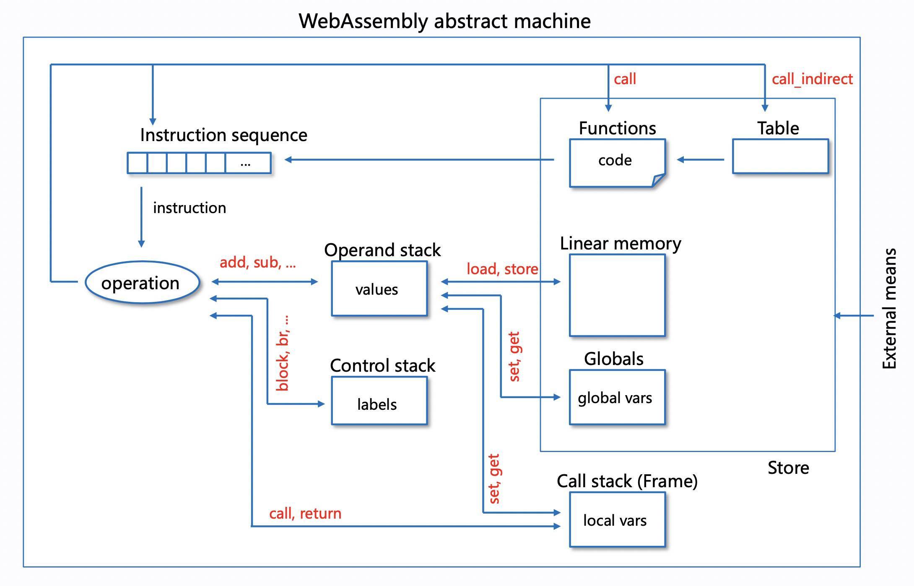

# TWA
Tiny pure C++ WebAssembly runtime with full [MVP](https://webassembly.github.io/spec/core/) features support (interpreter mode only). 



## Build

```
mkdir build
cd build
cmake ..
make
```

## Run

```
Usage:
  twa version
  twa run <file>
  twa run <file> --func <function> [args...]
  twa cmd
```

Fibnacci

```
cd bin
./twa run fib.c.wasm --func fib 30
```

CommandLine mode

```
:init
:load <file>
<function> [args...]
```

## License
This code is licensed under the MIT License (see [LICENSE](LICENSE)).
